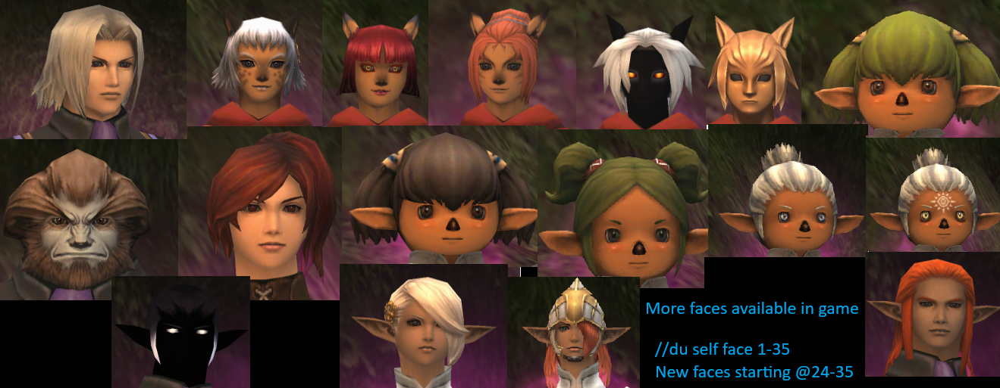

All models added to the [gear].lua files up until June 2026.

This code sits outside of the Official Windower Dressup code.  I've got all the models listed in this repository. If you play Final Fantasy 14 this addon is the FFXI equivalent of Glamour. 
Due to creative differences I'm not putting this into the official Lua repo.

I also refactored not just the [gear].lua files but the DressUp.lua, static_variables.lua, and helper_functions.lua
The code needed a cleanup.

# DressUp

* Allows you to specify custom gear models for yourself, others, or individual players. Also allows for 1:1 model replacement similar to the functionality of .DAT swapping.
* Emulates BlinkMeNot functionality to prevent model blinking when equipment changes.
* Includes up-to-date mappings for thousands of weapons and armor extracted directly from the game's DATs.
* **Uses packets**.

----

#### Settings

* DressUp uses `settings.xml` in its data folder for all settings related to models, blinking, and profiles.

**Abbreviation:** `//du`

#### Commands:
* **`//du help`**
  Displays the command menu in game.

* **`//du self|others|player <name> [race|face|slot] [item name|id] [ag]`**
  Assigns models to yourself, others, or an individual player.
  **Slots:** `head`, `body`, `hands`, `legs`, `feet`, `main`, `sub`, `ranged`.
  Appending `ag` or `afterglow` to a weapon command assigns its afterglow version.
  *Examples:* 
  `//du self head "walahra turban"`
  `//du self main opashoro ag`
  `//du others race mithra female`

* **`//du clear [self|others|player] <name> [race|face|slot]`**
  Clears settings for the specified selection.
  *Examples:*
  `//du clear self head`
  `//du clear player Voliathon`

* **`//du replacements [race|face|slot] <selection1> <selection2>`**
  Handles 1:1 model replacement (swapping how an item looks for everyone), similar to .DAT swapping. 

* **`//du blinking [self|others|party|follow|all] [always|target|combat|all] [on|off]`**
  Changes blinking prevention settings. Also accepts `bmn` and `blinkmenot`.
  Use `//du blinking settings` to display your current active blink rules in chat.

* **`//du autoupdate`** (or `//du au`)
  Toggles auto-update mode. When on, your character's appearance updates instantly as you type commands.

* **`//du save|load|delete <profile name>`**
  Manages appearance profiles. Profiles named after your short job name (e.g., `WAR`, `RDM`) or `CharacterName_JOB` are automatically loaded when you change jobs.

----

#### To do:
* Nothing for now
  
